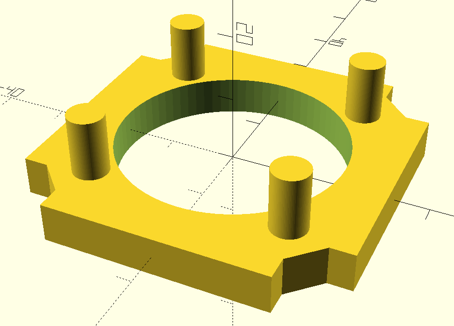
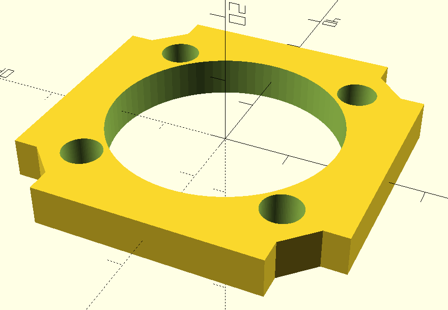
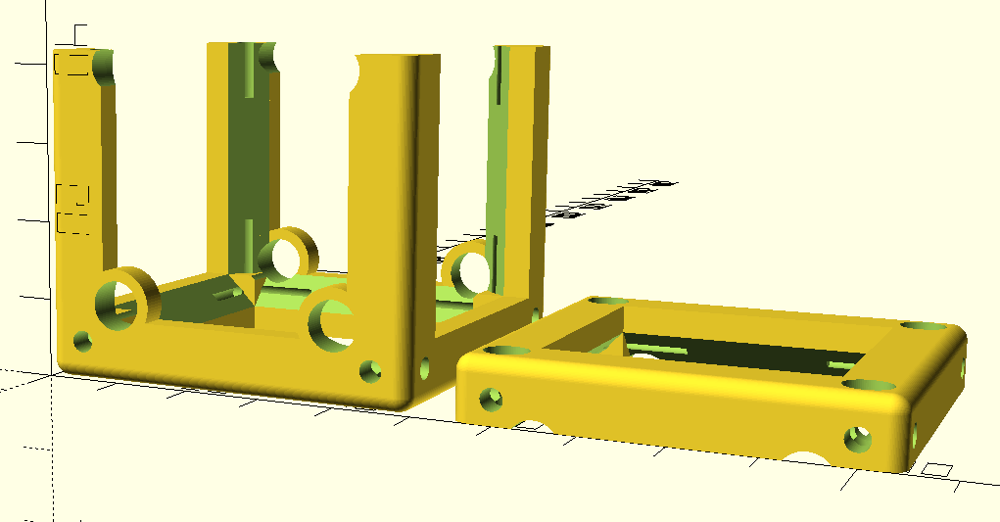

# UC2 - cage system compatibility  
Establishing an open standard in lab equipment for optics involves bridging to commercially available devices like the _Thorlabs PDF10A2_ luminometer. With the following inserts and cubes, you should be able to combine our components with the ones frequently used in optical setups.  

## Insert an integrated luminescence chemistry component into the UC2 cube
It is made for 12 mm cuvettes. However, every 3D printer is a bit different. You can adjust their dimensions to fit te parts perfectly.

Use _OpenSCAD_ to edit the .scad files and change the dimensions.

## Combine the integrated luminescence chemistry cube with the cubes
It might be used stand-alone with cuvette, cooler and one luminometer. But, two sides are open for additional optical sensors, cameras, thermography and more, placed in cubes. 

## Using _OpenSCAD_
Both inserts can of course be also adapted directly in _OpenSCAD_. Find all the .scad files in this folder, change the diameter of the rods/holes by changing `l_cuv`, `w_cuv` for the cuvette or `r_lum` for the luminometer, render it, export an STL file and print it.

In case you're not happy with the way the  (it might vary among different 3D printers), you can also fiddle with any of the values in the code.  
If you have a suggestion for an improvement, please let us know! :-)
