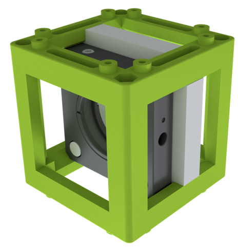
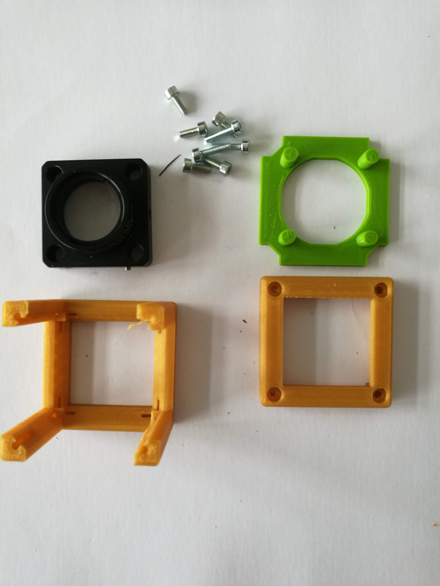
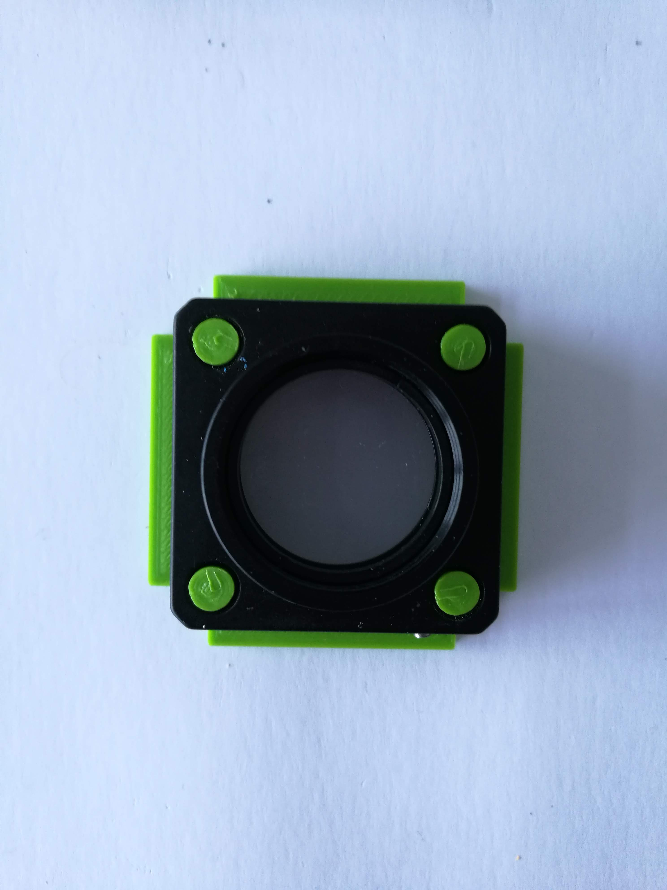
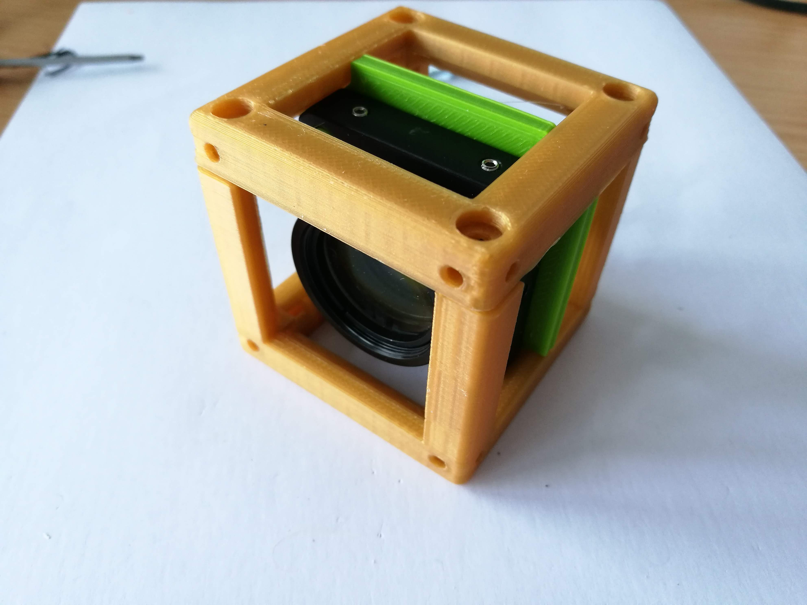

# Luminescence Chemistry Insert Cube
This is the repository for the Insert which adapts the UC2 System for luminescence chemistry analyzation.

The model is designed using _OpenSCAD_. You can export the STL files from this software.

## Purpose
It integrates a cuvette, a _Thorlabs PDF10A2_ luminometer and a _Thorlabs TECD2_ peltier element to analyze luminescence chemistry reactions.

### Properties
* design is derived from the base-cube

## Parts
Have a look in the [OPENSCAD folder](./OPENSCAD) to learn more about making UC2 cubes for luminescence chemistry!

###  3D printing parts
* PETG, dried for 24 h
* No support needed in all designs
* No brin/raft
* 100% fan speed
* Carefully remove all support structures (if applicable)

The Cube consists of the following components.

#### Default:
* **3DP Cube** which houses the insert and adapts it into a UC2 setup.
* **The Luminescence Chemistry Insert** which holds a cuvette, the _Thorlabs PDF10A2_ and a Peltier cooler.

###  Additional parts
* Check out the [RESOURCES for Luminescence for Chemistry](../../TUTORIALS/RESOURCES/Resources_Luminescence_Chemistry.md) for more information!
* Cuvette
* _Thorlabs PDF10A2_ luminometer
* _Thorlabs TECD2_ peltier element
* water cooler for the peltier element
* magnetic stirrer

##  Assembly
* Mount the peltier element and the water cooler in the Insert, add the luminometer
* Put the Insert inside the Cube
* Close the cube accordingly (IM/3DP)
* Done!

### Tutorial with images
:grey_exclamation: This tutorial shows a UC2_v2 cube but the assembly of the insert is still the same. For assembly of the cube (IM/3DP) check the [ASSEMBLY_CUBE_Base](../ASSEMBLY_CUBE_Base).

1. All parts for this model

2. Put the insert inside the insert

3. Mount everything with screws - Done!

